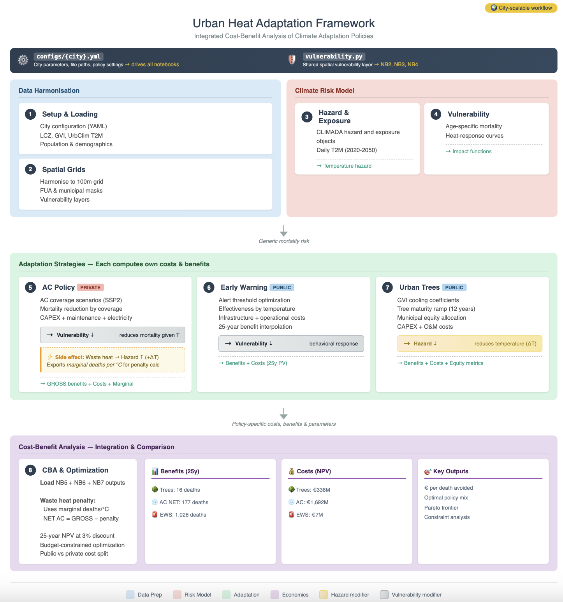

<div align="center">

  <h1>URBADAPT-HEAT</h1>

  <p><strong>A scalable geospatial framework for city-level urban heat risk assessment<br>and public–private adaptation cost-benefit analysis</strong></p>

  <p>
    <a href="https://github.com/URBADAPT/URBADAPT-HEAT/blob/main/LICENSE"></a>
    
    
    
  </p>

  <p>
    <a href="https://github.com/URBADAPT/URBADAPT-HEAT/wiki">📖 Wiki</a> ·
    <a href="#installation">⚙️ Installation</a> ·
    <a href="#quick-start">🚀 Quick start</a> ·
    <a href="#citation">📄 Citation</a>
  </p>
</div>

---

## Overview

**URBADAPT-HEAT v1.0** is the heat-specific implementation of the URBADAPT modular framework for urban climate risk assessment and adaptation planning. Built on the [CLIMADA](https://github.com/CLIMADA-project/climada_python) probabilistic risk engine (v6.1.0), it provides a fully reproducible, city-agnostic pipeline that:

- **Maps urban heat hazard** at ~100 m resolution from the [UrbClim](https://www.vito.be/en/urbclim) high-resolution urban climate dataset, for a 2020 synthetic baseline and climate projections to 2050 under four CMIP6 scenarios.
- **Quantifies heat-attributable mortality** using age-stratified population exposure ([WorldPop](https://www.worldpop.org/) + [Wittgenstein Centre](https://www.oeaw.ac.at/vid/data-and-information-systems/wittgenstein-centre-data-explorer) demographics) and epidemiologically calibrated impact functions ([Burke et al. 2025](https://doi.org/10.1038/s41591-024-03094-4)).
- **Evaluates three adaptation pathways** — air conditioning (AC), urban street trees, and early warning systems (EWS) — through their physical mechanisms (hazard modification, impact-function attenuation, event-specific mortality reduction), explicitly representing cross-pathway interactions.
- **Integrates a 25-year discounted cost-benefit analysis** including externalities (AC waste heat), co-benefits (vegetation → reduced AC electricity demand), and distributional outcomes stratified by a composite Social Vulnerability Index.
- **Identifies cost-effective adaptation portfolios** via Pareto-frontier budget optimisation.

Configuration is fully externalised to city-specific YAML files — the same analytical code runs unchanged across all cities.

<div align="center">

</div>

---

## Repository structure

```text
URBADAPT-HEAT/
├── logo_urbadapt.png
├── LICENSE                          # CC0 1.0
└── urban-heat/
    ├── environment.yml              # Conda environment (Python 3.10, conda-forge)
    ├── pyproject.toml               # cityheat package metadata
    ├── launch_windows.bat           # One-click Windows launcher
    ├── cityheat/                    # Python helper package
    │   ├── config.py                # YAML config loader/validator
    │   ├── data_io.py               # Raster, NetCDF, geodata I/O
    │   ├── grids.py                 # Reference grid, reprojection, FUA mask
    │   ├── hazards.py               # UrbClim T2M processing, tree-cooling scaling
    │   ├── impacts.py               # Age-varying impact functions, deaths with AC
    │   ├── benefits.py              # Event-to-annual interpolation, discounting, PV
    │   ├── costs.py                 # AC CAPEX/maintenance/electricity PV calculators
    │   ├── ac_downscale.py          # Logistic income-rank AC coverage downscaling
    │   ├── trees.py                 # ΔGVI → cost mapping, ramp years, O&M/CAPEX split
    │   ├── mix.py                   # Budget grid-search, Pareto-optimal policy mixes
    │   ├── vulnerability_layer.py   # Static and dynamic SVI construction
    │   ├── nb09_improved.py         # Monte Carlo uncertainty quantification (PAWN)
    │   ├── nb10_summary.py          # Summary statistics and reporting
    │   ├── plotting.py              # Standard maps and result figures
    │   └── run_city.py              # Full-city pipeline orchestrator
    ├── configs/                     # City-specific YAML configuration files
    │   ├── rome.yml
    │   ├── athens.yml
    │   ├── lisbon.yml
    │   ├── copenhagen.yml
    │   ├── genova.yml
    │   └── barcelona.yml
    ├── data_manifests/              # Google Drive sync manifests (per city)
    ├── scripts/                     # Standalone preprocessing scripts
    │   ├── build_delta_bands.py     # Build CMIP6 climate-uncertainty delta CSV
    │   ├── build_dynamic_exposures.py
    │   ├── build_projected_vulnerability.py
    │   ├── download_drmkc_vulnerability.py
    │   └── prepare_gvi_projections.py
    ├── notebooks/
    │   ├── 00_run_city.ipynb        # Driver notebook (calls run_city.py)
    │   └── city_agnostic/
    │       └── January2026/         # Canonical city-agnostic pipeline
    │           ├── 01_setup_0126.ipynb
    │           ├── 02_grids_0126.ipynb
    │           ├── 03_hazard_exposure_0126.ipynb
    │           ├── 04_impact_functions_0126.ipynb
    │           ├── 05_AC_0126.ipynb
    │           ├── 06_EWS_0126.ipynb
    │           ├── 07_vegetation_0126.ipynb
    │           └── 08_CBA_0126.ipynb
    │       └── <City>/March2026/    # City-specific runs with uncertainty (NB09, NB10)
    ├── data/                        # Input data (gitignored; synced from Drive)
    └── outputs/                     # Model outputs (gitignored)
```

---

## Installation

### Prerequisites

- [Miniconda](https://docs.conda.io/en/latest/miniconda.html) or Anaconda
- Git

### Step-by-step

**1. Clone the repository**

```bash
git clone https://github.com/URBADAPT/URBADAPT-HEAT.git
cd URBADAPT-HEAT
```

**2. Create and activate the conda environment**

```bash
conda env create -f urban-heat/environment.yml
conda activate urbanheat
```

All packages install from the `conda-forge` channel. Key pinned dependencies: Python 3.10 · CLIMADA 6.1.0 · rasterio 1.4.3 · geopandas 1.1.1 · xarray 2025.6.1.

**3. Install the `cityheat` helper package**

```bash
cd urban-heat
pip install -e .
```

**4. Register the Jupyter kernel**

```bash
python -m ipykernel install --user --name urbanheat --display-name "Python (urbanheat)"
```

**5. Launch JupyterLab**

```bash
jupyter-lab
```

> **Windows shortcut:** edit `PROJECT_DIR` in `urban-heat/launch_windows.bat` and double-click. It handles conda activation, environment creation, kernel registration, and JupyterLab launch automatically.

---

## Data access

Input data are **not included in the repository** (size). They are stored on Google Drive and synced via city-specific manifests in `urban-heat/data_manifests/` using `gdown`. The first pipeline notebook (`01_setup_*.ipynb`) performs the sync automatically.

**DRMKC vulnerability data** (used for dynamic SVI projection) require a personal JWT token from the [JRC Risk Data Hub](https://drmkc.jrc.ec.europa.eu/risk-data-hub):

```bash
python scripts/download_drmkc_vulnerability.py --token YOUR_JWT_TOKEN --country IT
```

**UrbClim climate data** are fetched from the PROVIDE/VITO API; endpoints and city identifiers are specified in each city YAML config.

---

## Quick start

Once the environment is set up and data are in place, open the notebooks in order and point each to your city YAML at the top of the cell:

| # | Notebook | What it does |
|---|---|---|
| 01 | `01_setup_0126.ipynb` | Load config, resolve paths, sync data |
| 02 | `02_grids_0126.ipynb` | Build reference grid and FUA mask |
| 03 | `03_hazard_exposure_0126.ipynb` | Build daily T2M hazard; map population exposure |
| 04 | `04_impact_functions_0126.ipynb` | Age-specific heat-mortality impact functions; baseline deaths |
| 05 | `05_AC_0126.ipynb` | AC penetration downscaling; policy scenarios; waste-heat feedback |
| 06 | `06_EWS_0126.ipynb` | Early warning system; warning days; avoided deaths and costs |
| 07 | `07_vegetation_0126.ipynb` | GVI → LST → T2M cooling; tree-planting allocation and costs |
| 08 | `08_CBA_0126.ipynb` | 25-year CBA; Pareto optimisation; equity stratification |
| 09 | `09_uncertainty_*.ipynb` | Monte Carlo uncertainty; PAWN global sensitivity |
| 10 | `10_summary_*.ipynb` | Aggregated results tables and figures |

All city-specific parameters (NUTS3 identifiers, AC penetration rates, vulnerability projection parameters, tree costs, EWS thresholds, etc.) are controlled by the YAML config in `urban-heat/configs/`. See the [City Configuration wiki page](https://github.com/URBADAPT/URBADAPT-HEAT/wiki/City-Configuration) for the full parameter reference.

---

## Documentation

Full documentation is available on the [project wiki](https://github.com/URBADAPT/URBADAPT-HEAT/wiki):

| Page | Description |
|---|---|
| [Installation & Usage](https://github.com/URBADAPT/URBADAPT-HEAT/wiki/Installation) | Detailed setup, data access, pipeline walkthrough |
| [Framework Overview](https://github.com/URBADAPT/URBADAPT-HEAT/wiki/Framework-Overview) | Architecture, design principles, module map |
| [Hazard](https://github.com/URBADAPT/URBADAPT-HEAT/wiki/Hazard) | UrbClim T2M, synthetic baseline, CMIP6 delta scaling |
| [Exposure](https://github.com/URBADAPT/URBADAPT-HEAT/wiki/Exposure) | Age-stratified population, WorldPop, Wittgenstein Centre |
| [Vulnerability](https://github.com/URBADAPT/URBADAPT-HEAT/wiki/Vulnerability) | Composite SVI, dynamic projection, city parameters |
| [Impact Functions](https://github.com/URBADAPT/URBADAPT-HEAT/wiki/Impact-Functions) | Burke (2025) calibration, dose-response equations |
| [Adaptation Pathways](https://github.com/URBADAPT/URBADAPT-HEAT/wiki/Adaptation-Pathways) | AC, street trees, EWS, cross-pathway interactions |
| [Cost-Benefit Analysis](https://github.com/URBADAPT/URBADAPT-HEAT/wiki/Cost-Benefit-Analysis) | 25-year CBA, budget optimisation, equity outputs |
| [Uncertainty Analysis](https://github.com/URBADAPT/URBADAPT-HEAT/wiki/Uncertainty-Analysis) | Structural, climate, parametric sensitivity (PAWN) |
| [City Configuration](https://github.com/URBADAPT/URBADAPT-HEAT/wiki/City-Configuration) | YAML reference, adding a new city |
| [Case Studies](https://github.com/URBADAPT/URBADAPT-HEAT/wiki/Case-Studies) | Rome · Athens · Lisbon · Copenhagen results |

---

## Citation

If you use URBADAPT-HEAT in your research, please cite:

> Aboudrar-Méda, A. & Falchetta, G. (in review). *URBADAPT-HEAT v1.0: a scalable geospatial framework for city-level public-private adaptation infrastructure cost-benefit analysis and its urban heat risk implementation*. Geoscientific Model Development.

```bibtex
@article{aboudrar_falchetta_2025_urbadaptheat,
  author  = {Aboudrar-M{\'e}da, Armande and Falchetta, Giacomo},
  title   = {{URBADAPT-HEAT} v1.0: a scalable geospatial framework for city-level
             public-private adaptation infrastructure cost-benefit analysis
             and its urban heat risk implementation},
  journal = {Geoscientific Model Development},
  year    = {in review}
}
```

## License

This repository is released under the **Creative Commons Zero v1.0 Universal (CC0 1.0)** public domain dedication. See [LICENSE](LICENSE) for details.

---

## Authors and contact

| Name | Affiliation | Contact |
|---|---|---|
| **Armande Aboudrar-Méda** | CMCC | armande.aboudrar-meda@cmcc.it |
| **Giacomo Falchetta** | CMCC, IIASA | giacomo.falchetta@cmcc.it |
